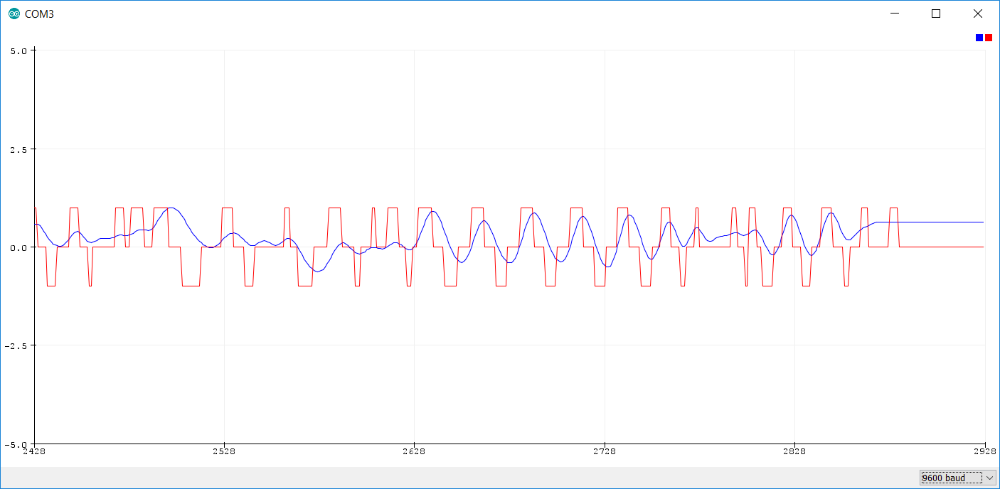

# Z-Score Peak Detection [WORK-IN-PROGRESS]

Used a z-score filtering for realtime peak detection in noisy sensor data.
All credit for algo goes to: https://stackoverflow.com/questions/22583391/peak-signal-detection-in-realtime-timeseries-data

I've packaged the algorithm as a class in Arduino to make it easier to attach to sensors.

```c
//Usage sample
#include "zFilter.h"
zFilter* detector = new zFilter();

//Main function is filter() -> returns {-1, 0, 1}
//representing below, within, above standard deviation threshold
int signal = detector.filter(data);

//Optional Configuration for tweaking parameters
detector.configure(lag, threshold, influence);

//Default has max lag of 32, to increase, give an upper-bound
//lag as param in constructor before configuration
zFilter* detector = new zFilter(64);
```

## Sample Result (Manually Tweaking a Potentiometer...)

